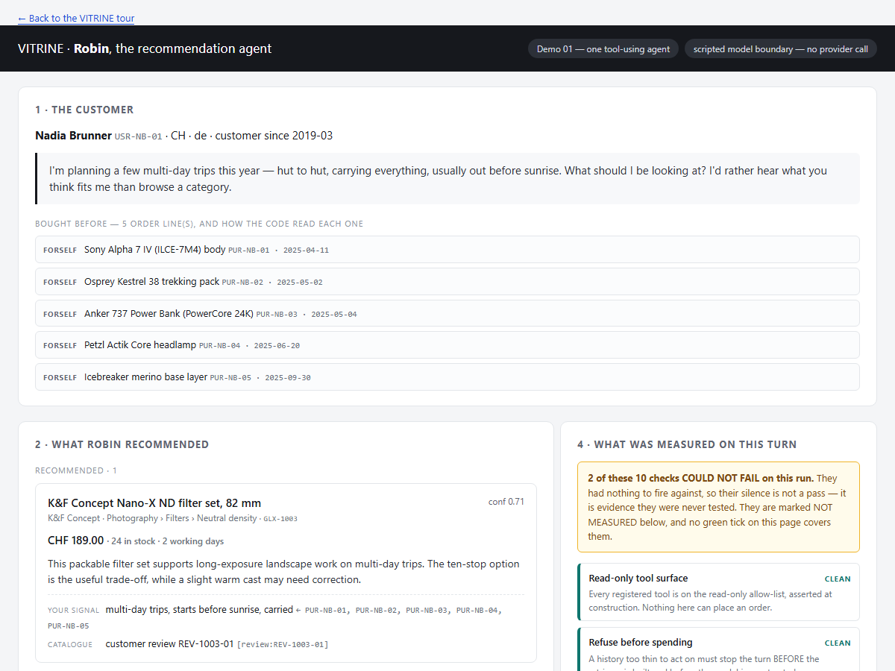

<!-- SPDX-License-Identifier: MIT -->
# VITRINE

**[Open the live VITRINE documentation and 60-second tour](https://azuresamurai.blog/Vitrine/)** ·
[plain-language summary](https://azuresamurai.blog/Vitrine/Vitrine-One-Page-Summary.html) ·
[source](https://github.com/joslat/Vitrine)

[](https://azuresamurai.blog/Vitrine/)
[](https://github.com/joslat/Vitrine/actions/workflows/ci.yml?query=branch%3Amain)
[](https://github.com/joslat/Vitrine/releases/latest)
[](LICENSE)

I built VITRINE to show how I can connect realistic e-commerce product discovery with an
evaluation discipline: make an agent and a controlled workflow solve the same shopping needs,
then preserve evidence about their quality, reliability, safety, and cost.

Built by [José Luis Latorre Millas](https://www.linkedin.com/in/joslat/) — Agentic & Software
Architect, Microsoft AI MVP, creator of [AgentEval](https://github.com/AgentEvalHQ/AgentEval), and
Microsoft Agent Framework contributor. [Profile and talks](https://sessionize.com/joslat/) ·
[GitHub](https://github.com/joslat)

## What the customer sees

Start with the [complete checked-in recommendation for Nadia](https://azuresamurai.blog/Vitrine/reports/demo01-scripted.html):
one synthetic customer request becomes a screened product card with current catalogue price, stock,
the customer signal used, and the catalogue fact supporting each suggestion. This particular
receipt runs the real `ChatClientAgent` and real tools against a committed deterministic model
boundary, so it is inspectable without pretending it is a paid-model result.



The four paid-evaluation scenarios ask different product questions: **Nadia** needs several travel,
hiking, power, and photography signals connected; **Sofia** needs replenishment separated from a
missing durable capability; **Marco** needs gift purchases excluded from his own interests; and
**Luca** needs the assistant to ask rather than invent confidence from thin evidence.

The 60-second path is: [see the customer output](https://azuresamurai.blog/Vitrine/reports/demo01-scripted.html) →
[understand the two implementations](https://azuresamurai.blog/Vitrine/#demos) →
[inspect the saved evidence](https://azuresamurai.blog/Vitrine/reports/evals-offline.html) →
[read what it does and does not prove](https://azuresamurai.blog/Vitrine/Vitrine-One-Page-Summary.html).

> **Independent job-application sample for Digitec Galaxus.** It is not affiliated with,
> commissioned by, or endorsed by Digitec Galaxus. The catalogue records, prices, stock,
> reviews, personas, histories, and relationships are authored/synthetic; recognizable
> third-party product names and trademarks are used illustratively. Its results do not measure a
> Digitec Galaxus system.

The live **[VITRINE documentation hub](https://azuresamurai.blog/Vitrine/)** is the canonical,
shareable front door. Its checked-in source links to the
[value proposal](https://azuresamurai.blog/Vitrine/Vitrine-Digitec-Galaxus-Value-Proposal.html),
[operator walkthrough](https://azuresamurai.blog/Vitrine/Vitrine-Walkthrough.html),
[architecture](https://azuresamurai.blog/Vitrine/Vitrine-Architecture.html),
[evaluation protocol](https://azuresamurai.blog/Vitrine/Vitrine-Evaluation-Protocol.html),
[retrieval deep dive](https://azuresamurai.blog/Vitrine/Vitrine-Retrieval-Deep-Dive.html), and
[verification receipt](https://azuresamurai.blog/Vitrine/Vitrine-Verification.html).

VITRINE is also an applied demonstration of my work on
[AgentEval](https://github.com/AgentEvalHQ/AgentEval): the framework's admitted checks, benchmark
arms, native comparisons, statistics, output stores, and real `RedTeamRunner` are exercised
against a working synthetic commerce subject rather than described in isolation.

Related platform work:

- [AgentEval](https://github.com/AgentEvalHQ/AgentEval) — the .NET evaluation toolkit I created;
  VITRINE consumes its published package rather than a source checkout.
- [agent-memory-dotnet](https://github.com/joslat/agent-memory-dotnet) — my separate Neo4j-backed,
  graph-native memory provider for Microsoft Agent Framework with GraphRAG and MCP integration.
  It is adjacent knowledge-systems evidence, not a VITRINE dependency.

## What runs

- **Demo01:** one `ChatClientAgent` named Robin using 13 observed read-only functions.
- **Demo02:** a five-executor MAF discovery workflow with one visible reviewer → discovery loop.
- **Offline evals:** five mandatory evaluation gates, one matched-quality diagnostic, a persisted
  five-check recommendation benchmark, and 43 registered healthy → defect → recovery
  diagnostics. This is the default.
- **Paid evals:** Eval01–Eval05 measure four shared shopping scenarios across agent/workflow arms.
  Eval04/05 require every trial to be measured and every scenario's whole-trial 95% Wilson lower
  bound to reach 0.50 (minimum 4, default 5 repetitions); Eval03 adds a native paired comparison.
  Eval06 runs real
  AgentEval jailbreak and canary-backed system-prompt-extraction probes against fresh Robin agents.
- **Evidence control room:** runtime-derived graphs, correlated timeline evidence, an evaluation
  board, checksummed JSON/HTML export for accidental-change detection, and replay that executes
  nothing. The checksum is not a signature or proof against malicious replacement.

The repository keeps the cost boundary visible in source:

- `src/AgentEval.VitrineDemo.Evals/Evals/Offline` — credential-free suite and diagnostics.
- `src/AgentEval.VitrineDemo.Evals/Evals/Live` — named, explicitly confirmed paid plans.

## Ten-minute path

Prerequisites: .NET SDK 10 and PowerShell 7 (`pwsh`). The orchestration scripts, the 43-control
diagnostic panel, the Avalonia acceptance path, and the published CI lane are Windows-first. The projects themselves can
be built and tested on Linux when .NET 10 and `pwsh` are installed; direct `dotnet` commands below
avoid the Windows launcher script.

```powershell
# Open the control room; its default subject arm is deterministic and local.
.\start.ps1 -Mode App

# Run the single agent and workflow demos without an external provider.
.\start.ps1 -Mode Demo01
.\start.ps1 -Mode Demo02 -NoRestore

# Run the complete offline evidence chain and its diagnostics.
.\start.ps1 -Mode Evals -NoRestore
.\start.ps1 -Mode Controls -NoRestore

# Plant one isolated catalogue defect; detection intentionally exits non-zero.
.\start.ps1 -Mode Ablation -NoRestore
```

Direct commands:

```powershell
dotnet build AgentEval.VitrineDemo.slnx
dotnet test AgentEval.VitrineDemo.slnx --filter "Category!=LiveModel"
dotnet run --project src/AgentEval.VitrineDemo.Evals -- --all
dotnet run --project src/AgentEval.VitrineDemo.Evals -- --self-test

# Standalone subject selectors 1-6 are deterministic and offline by default.
dotnet run --project src/AgentEval.VitrineDemo -- 1
```

## Execution and cost boundary

The subject demos expose `ZeroModelBaseline`, deterministic local `ScriptedAgent`, and explicitly
selected `LiveAzure` arms. The evaluation runner separately exposes `OfflineSuite` plus six named
paid plans; it has no implicit live profile. Credentials alone never change the selected lane.

The standalone subject CLI also fails closed: selectors 1–6 remain offline unless both `--live`
and `--confirm-paid` are present. `--real-vectors` and `--rebuild-embeddings` can perform live
embedding work, so each also requires `--confirm-paid`. Every paid eval plan requires the same
confirmation, and the app requires the equivalent confirmation after showing the planned workload.
The public programmatic runner also requires an explicit `paidExecutionConfirmed: true` argument.
Readiness is checked before model execution; failure persists a non-success receipt and never
substitutes an offline result.

```powershell
# One deliberately explicit paid example.
dotnet run --project src/AgentEval.VitrineDemo.Evals -- `
  --eval-plan eval01-agent --scenario nadia-cross-category --confirm-paid

# One deliberately explicit provider-backed subject example.
dotnet run --project src/AgentEval.VitrineDemo -- 1 --live --confirm-paid
```

Optional live code reads `AZURE_OPENAI_ENDPOINT`, `AZURE_OPENAI_API_KEY`, and
`AZURE_OPENAI_DEPLOYMENT`. VITRINE never prints, persists, fingerprints, or hashes the key or
endpoint URL. Raw Eval06 prompts, responses, extraction canaries, system instructions, provider
messages, and exception text are excluded from its receipt.

Eval process classes are: `0` pass, `1` measured failure, `2` invalid arguments, `3` not measured,
and `4` infrastructure failure. Missing evidence remains absent—it is never displayed as zero.

## Repository map

- `src/AgentEval.VitrineDemo` — synthetic catalogue, personas, retrieval, tools, guardrails,
  Demo01, and Demo02.
- `src/AgentEval.VitrineDemo.Evals` — AgentEval integration, offline/live plans, CLI, reports, and
  local evidence persistence.
- `src/AgentEval.VitrineDemo.App` — optional Avalonia evidence-control-room, export, and replay
  module; the subject and eval CLIs do not depend on it.
- `tests/AgentEval.VitrineDemo.Tests` — credential-free integration, artifact, UI, graph,
  redaction, and failure-state coverage; live contracts are opt-in only.
- `docs` — the canonical HTML documentation site and sanitized generated evidence.
- `MIGRATION.md` — repository-native AgentEval 0.35 admission/API migration ledger.
- `eng/upstream` — source provenance and upstream MIT license.

Public-use boundaries are documented in [NOTICE.md](NOTICE.md), [DATA-PROVENANCE.md](DATA-PROVENANCE.md),
[SECURITY.md](SECURITY.md), and [THIRD-PARTY-NOTICES.md](THIRD-PARTY-NOTICES.md). The source is
available under the [MIT License](LICENSE).

## Verification

The current credential-free receipt is:

- Release build: 0 warnings, 0 errors.
- `Category!=LiveModel`: 361/361 passed, 0 failed, 0 skipped.
- Offline admitted-check self-test: exit 0.
- Offline check stages: 6/6 completed; all 5/5 mandatory evaluation gates pass, the matched-quality
  diagnostic is reported separately, and 43/43 registered mutation diagnostics are caught.
- Catalogue integrity self-test: expected exit 1, followed by a restored exit-0 run with all five
  mandatory gates passing and the matched-quality diagnostic reported.
- No live/provider call was made by the final acceptance commands.

See the [dated verification page](https://azuresamurai.blog/Vitrine/Vitrine-Verification.html) for the exact receipt and
incidents, and [MIGRATION.md](MIGRATION.md) for every admitted check, native floor, ablation, and
deliberately retained diagnostic/collector boundary.
